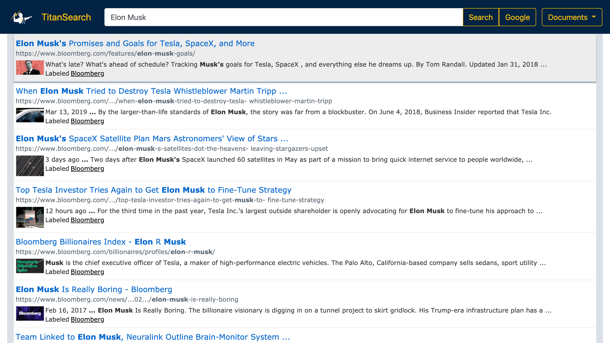

Developed a search engine with JavaScript and Google Custom Search API to solve a critical and costly business problem at TitanHouse, and designed it with Bootstrap. The search engine filtered through websites such as Bloomberg.com and LinkedIn.com to find the links we needed. My team members used the application tens of thousands of times. It significantly increased their productivity and the end user experience.
